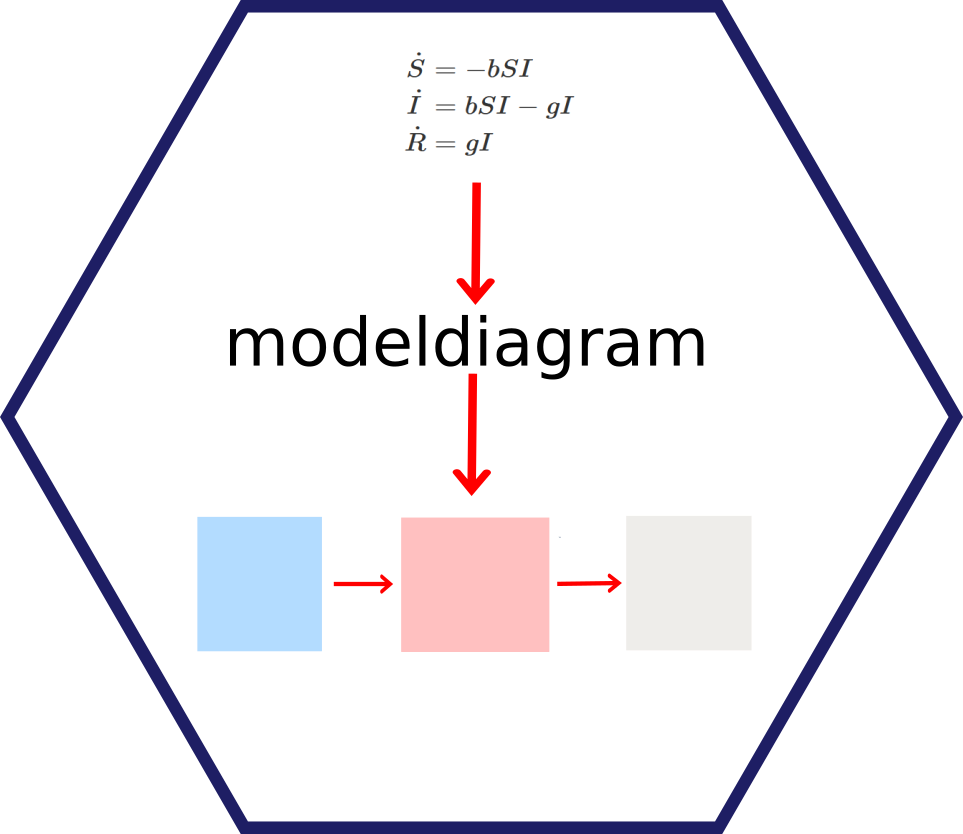

<!-- README.md is generated from README.Rmd. Please edit that file -->

```{r, echo = FALSE}
knitr::opts_chunk$set(
  collapse = TRUE,
  comment = "#>",
  fig.path = "man/figures/"
)
```

# modelbuilder 


<!-- badges: start -->
[](https://github.com/ahgroup/modelbuilder/actions)
[](https://codecov.io/github/ahgroup/modelbuilder?branch=master)
[](https://github.com/ahgroup/modelbuilder/actions)
[](https://github.com/ahgroup/modelbuilder/actions)
<!-- badges: end -->

A software package for graphical building and analysis of compartmental simulation models.

## Note
AS OF RIGHT NOW, THE PACKAGE HAS BASIC FUNCTIONALITY, BUT HAS NOT BEEN PROPERLY TESTED AND DEBUGGED YET!
This is an early version of the package, only some features are already implemented.


## Description
This R package provides functionality that lets the user build and analyze compartmental simulation models, implemented as ordinary differential equations, stochastic equivalents, or discrete time models.   
All model building and analysis can be done without writing code. The user can export code for one of the model implementations for further customization.


## Installation
I assume you have `R` installed. I also highly recommend `RStudio`, though it's not required.

The package has not yet been submitted to CRAN, therefore it currently needs to be installed from Github. To do so, you need the `remotes` package. If you don't have it, install it first. The following commands will get you up and running:

```r
install.packages('remotes')
remotes::install_github('ahgroup/modelbuilder')
```

## Basic Use
After install (which you need to do only once), load the package by runing `library('modelbuilder')`. You should receive a short greeting. Now you can open the main menu by running `modelbuilder()`. From the main menu, you can load a model, export code for a model, build a new or modify an existing model, and analyze model dynamics ofr a loaded model.

See the [Get Started section](https://ahgroup.github.io/modelbuilder/articles/modelbuilder.html) for a basic and currently sparse introduction.


## Contributing to the package
The package is on GitHub and you can use the usual GitHub process to contribute updated, bug fixes, etc. If you don't know how to do that or don't have the time, you can also file an issue on GitHub and let me know what should be changed. 

The package is built in a way that makes it (hopefully) easy for others to contribute simulation models for others to use. A formal structure for model sharing is forthcoming.


## Acknowledgements 
This R package is developed and maintained by [Andreas Handel](https://www.andreashandel.com/). A full list of contributors [can be found here](https://ahgroup.github.io/modelbuilder/authors.html). 

This project was/is partially supported by NIH grants U19AI117891, R01 GM124280 and GM 12480-03S1 and a grant from the University of Georgia's Center for Teaching and Learning. 


