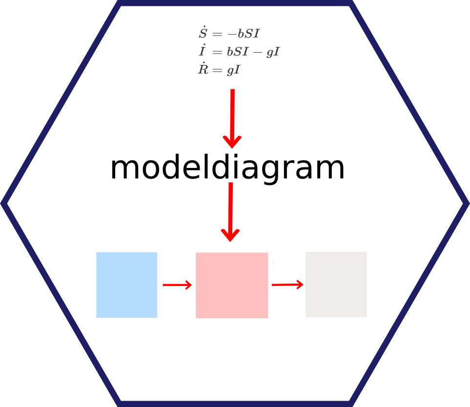

<!-- README.md is generated from README.Rmd. Please edit that file -->

# modelbuilder 

<!-- badges: start -->

<!-- badges: end -->

**modelbuilder - A package for graphical building and analysis of
compartmental simulation models**

## Note

**The package is under active development. This is an early version of
the package, only some features are already implemented. It should
mostly work, but has not been fully tested/debugged. Let us know if
something fails.**

## Description

This R package provides functionality that lets the user build and
analyze compartmental simulation models, implemented as ordinary
differential equations, stochastic equivalents, or discrete time models.
All model building and analysis can be done without writing code. The
user can export code for one of the model implementations for further
customization.

## Getting Started

The main use case is to install the R package and use it locally. If you
want to get a quick glimpse at the package to see if this package is for
you, you can give it [a quick try online, without having to install
it](https://shiny.ovpr.uga.edu/modelbuilder/). Note that not all
functionality might work in this online version.

If you like what you see, you can install it locally. I assume you have
`R` installed. I also highly recommend `RStudio`, though it’s not
required. The package has not yet been submitted to CRAN, therefore it
currently needs to be installed from Github. To do so, you need the
`remotes` package. If you don’t have it, install it first. Then, install
and get **modelbuilder** up and running with these commands:

    library('remotes') #install this package if you don't have it
    install_github('ahgroup/modelbuilder')
    library('modelbuilder')
    modelbuilder()

Next, see the [Get Started
section](https://ahgroup.github.io/modelbuilder/articles/modelbuilder.html)
for a basic and currently sparse - but hopefully still informative -
introduction.

## Further information

-   We developed two packages that teach the use of compartmental
    simulation models for use on the population level ([DSAIDE
    package](https://ahgroup.github.io/DSAIDE/)), and individual
    host/patient level ([DSAIRM
    package](https://ahgroup.github.io/DSAIRM/)). Those packages come
    with pre-coded simulations and are meant for learning, while
    **modelbuilder** lets you build your own models and is geared
    towards more advanced users.
-   I regularly teach courses related to infectious diseases and
    modeling. Materials covering population level infectious diseases
    and modeling [can be found
    here](https://andreashandel.github.io/IDEMAcourse/), similar
    materials covering modeling on the within-host, patient level [can
    be found here](https://andreashandel.github.io/SMIcourse/).
-   Contributions to the package are very welcome! If you want to take a
    deeper look at the package, see [this Markdown
    file](https://github.com/ahgroup/modelbuilder/blob/master/auxiliary/docsfordevelopers/documentation.md)
    which provides further information on the details of the package
    structure. I’d be excited to receive any contributions from
    individuals who want to help improve the package. If you plan to
    make substantial contributions, it might be best to get in touch
    with me first.
-   I send out a monthly newsletter in which (among other things) I
    announce any noteworthy updates to my R packages. If you want to
    stay updated, [you can sign up
    here](https://www.andreashandel.com/susbscribe/).

## Acknowledgements

This R package is developed and maintained by [Andreas
Handel](https://www.andreashandel.com/). A full list of contributors
[can be found
here](https://ahgroup.github.io/modelbuilder/authors.html).

This project was/is partially supported by NIH grants U19AI117891, R01
GM124280 and GM 12480-03S1 and a grant from the University of Georgia’s
Center for Teaching and Learning.
